# ARCHITECTURE.md — AMHUB

> **Technical architecture reference for this repository.** Must stay in sync with the implementation.
> If you change a flow described here, update this file in the same commit.
> Companion docs: `PROJECT.md` (project overview / source of truth) and `TODO.md` (audit findings).
> Read `CLAUDE.md` in the repo root for the "gotchas" that every contributor must know.

**Last updated:** 2026-08-03
**Verified against:** `pnpm typecheck` ✅ · `pnpm build` ✅ · `pnpm lint` ✅ (2026-08-03, BUG-2 fixed)

---

## 0. Sync Contract (keep this doc honest)

This document is considered stale if any of these change without the doc being updated:

1. A new route/page under `apps/web/src/app/**` (page or API).
2. A change in `supabase/migrations/*` (tables, RLS policies, storage buckets, triggers).
3. A change in `apps/web/src/dal/*` or `apps/web/src/lib/**` (clients, auth, api plumbing, mappers).
4. A change in dependency graph (`package.json` of `apps/web` or `packages/*`).
5. A change in the middleware matcher/protected routes.
6. A change in the mobile/desktop split pattern (`Mobile*View` / `hidden md:block`).

Verification loop after any change: `pnpm typecheck` → `pnpm lint` → `pnpm build` → update the "Verified against" line.

---

## 1. Dependency Graph

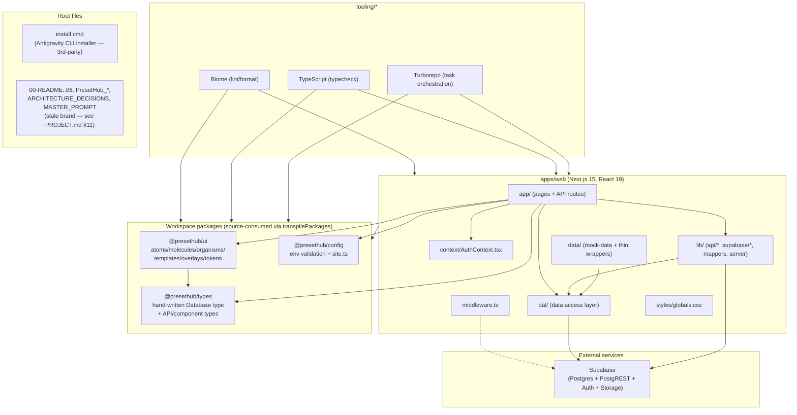

**Key external dependencies (apps/web):** `next`, `react`, `@supabase/ssr`, `@supabase/supabase-js`, `zod`, `lucide-react`, `tailwindcss@4`.
**Installed but UNUSED (apps/web):** `@tanstack/react-query`, `zustand`, `framer-motion`, `react-hook-form`, `@hookform/resolvers` — do not import them; remove them when the rebrand cleanup lands (TODO TD-2).
**packages/ui deps:** `class-variance-authority`, `clsx`, `tailwind-merge`, `@radix-ui/react-slot` (1 use), `@floating-ui/react` (1 use), `lucide-react`.

---

## 2. Request Flow

Two distinct request families:

### 2a. Server-rendered page request (SSR)

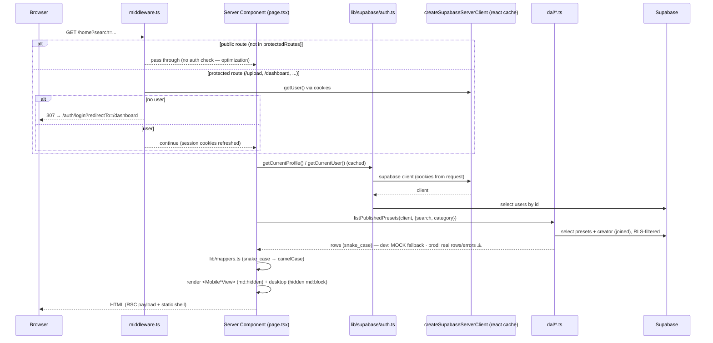

### 2b. Client API request (fetch /api/...)

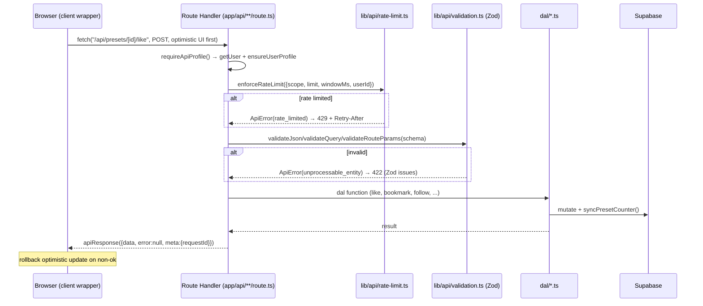

---

## 3. Auth Flow

**Stack:** Supabase Auth (email/password + Google OAuth) via `@supabase/ssr` cookie-based sessions.

- **Browser client:** `createSupabaseBrowserClient()` (`lib/supabase/client.ts`) — used in `auth/login`, `auth/register`, `AuthModal`.
- **Server client:** `createSupabaseServerClient()` (`lib/supabase/server.ts`) — cookie store from `next/headers`, wrapped in React `cache()`; `setAll` swallowed in Server Components (only middleware/route handlers can write cookies).
- **Profile bootstrap:** `ensureUserProfile(user)` — after auth, upserts a `users` row: normalizes username (`^[a-z0-9_]{3,24}$`, lowercased, fallback `user_<id8>`), display name from metadata, avatar from metadata, `auth_provider` from `app_metadata.provider`; retries on unique-violation (`23505`) with `username_<id8>`.
- **Server-side helpers** (`lib/supabase/auth.ts`): `getCurrentUser` (React `cache()`), `requireUser` (redirect → `/auth/login`), `getCurrentProfile` (user + profile, bootstraps if missing).
- **Client-side gating** (`context/AuthContext.tsx`): `useAuth().requireAuth(action, title)` — if logged in runs `action()`, else opens `AuthModal` (Google sign-in) with an optional title. No redirect; the modal is the gate.

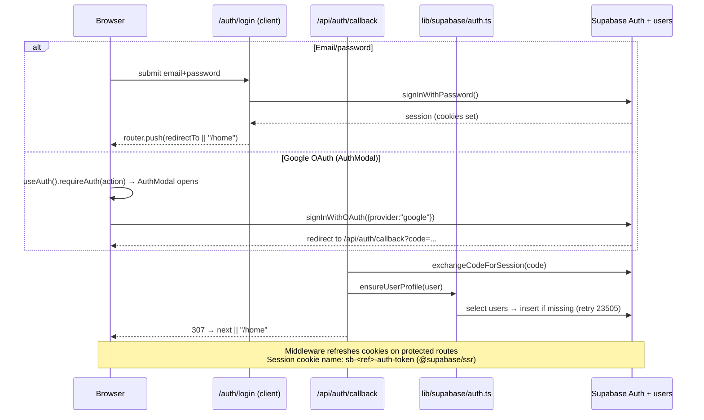

**Logout:** `GET /api/auth/logout` → `supabase.auth.signOut()` → redirect `/auth/login`.

---

## 4. Upload Flow (presigned URL)

**Design:** the server never sees file bytes. Client POSTs metadata → server validates + issues a short-lived signed upload URL → client PUTs bytes directly to Supabase Storage → server persists the `storage_path`.

- **Endpoints:** `POST /api/uploads/preset` (xml | qr | thumbnail, 10/min) and `POST /api/uploads/avatar` (5/min).
- **Limits** (`lib/api/uploads.ts` `UPLOAD_LIMITS`): avatar 5MB, thumbnail 10MB, presetXml 5MB, presetQr 5MB — MIME + extension allowlists per kind.
- **Path scheme:** `{ownerId}/{uuid}.{ext}` — owner prefix enables RLS folder ownership; extension derived from MIME allowlist, never from client filename.
- **Sanitization:** `sanitizeFilename` (NFC normalize, strip null bytes, basename only, `[^a-zA-Z0-9._-]` → `_`, ≤200 chars).
- **Buckets:** `thumbnails` (public), `avatars` (public), `preset-files` (private — served via signed URL when downloads exist; currently **no download endpoint**, TODO MISS-1).

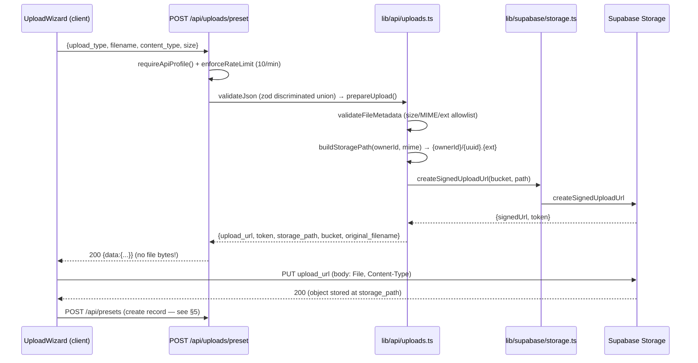

---

## 5. Preset Publishing Flow

`UploadWizard` (`apps/web/src/app/upload/_components/`) is a 4-step client wizard: **Format & File → Thumbnail → Details → Review & Publish**. Form state is local `useState` (no react-hook-form).

Steps at publish time (in order, single handler):

1. Prepare + PUT **thumbnail** (if provided) via `/api/uploads/preset` → keep `storage_path`.
2. Prepare + PUT **preset file** (if `xml`/`qr`) via `/api/uploads/preset` → keep `storage_path`. (`link` type skips files; `am_link` is stored instead.)
3. **Create record:** `POST /api/presets` with `{slug, title, description, thumbnail_url, file_type, file_url?, am_link?, category, difficulty}`. Slug is generated client-side: `title → kebab-case` + `-` + last 4 digits of `Date.now()`.
4. `router.push(/preset/${slug})`.

Server side (`POST /api/presets`): `requireApiProfile` → rate limit (10/min) → Zod validate → `createPreset` DAL → row inserted with **`status = 'pending'`** (default) → RLS means only owner/staff can see it until `status = 'published'` → there is **no moderation/admin UI yet** (TODO MISS-7), so published presets can only appear via direct DB update or a future staff flow.

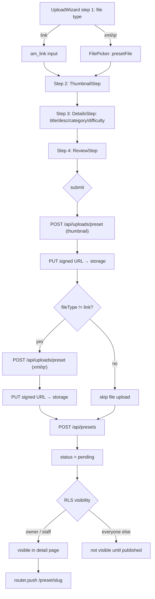

---

## 6. Supabase Interaction

Three client constructors — all typed with the hand-written `Database` from `@presethub/types`:

| Constructor | Location | Cookies? | Used by |
|---|---|---|---|
| `createSupabaseBrowserClient()` | `lib/supabase/client.ts` | yes (browser) | login/register pages, AuthModal |
| `createSupabaseServerClient()` | `lib/supabase/server.ts` | yes (request cookies) | pages, route handlers, DAL |
| `createSupabaseServiceClient()` | `lib/supabase/server.ts` | no (service role) | **unused** (dead code, TODO TD-1) |

- **Typing:** `PresetHubSupabaseClient = ReturnType<typeof createBrowserClient<Database>>` — the server client is cast to this type; `DalClient` in `dal/types.ts` is an alias of it.
- **Env validation:** `validatePublicEnv()` (URL + anon key) runs in both clients; `validateServerEnv()` (adds `SUPABASE_SERVICE_ROLE_KEY`) only in the service client. During Next build both skip required checks; they throw at runtime.
- **Storage:** `lib/supabase/storage.ts` — `storageBuckets` map, `getPresetStorageBucket(fileType)` (⚠️ ignores its argument, TODO BUG-3), `createSignedDownloadUrl` (⚠️ dead code), `createSignedUploadUrl` (used by uploads).
- **Realtime:** `lib/supabase/realtime.ts` exists but **nothing subscribes** (TODO TD-5).

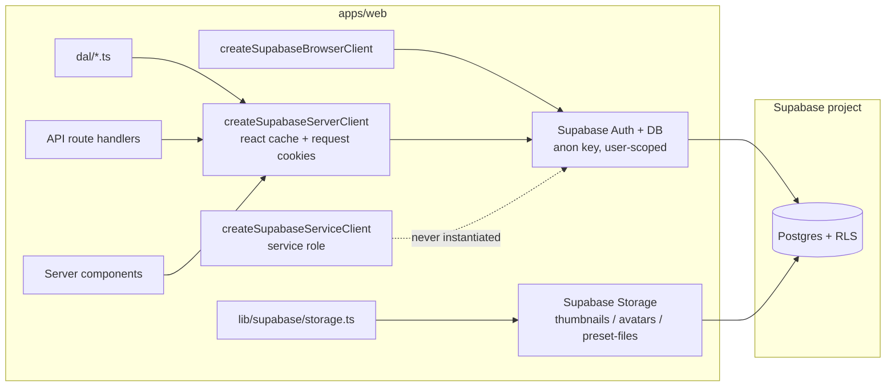

---

## 7. RLS Flow

**Model:** every table has `alter table ... enable row level security` + named policies. Privilege escalation helper: `is_staff()` — a `security definer` function that checks `users.is_staff` for the current `auth.uid()` (immune to direct table reads).

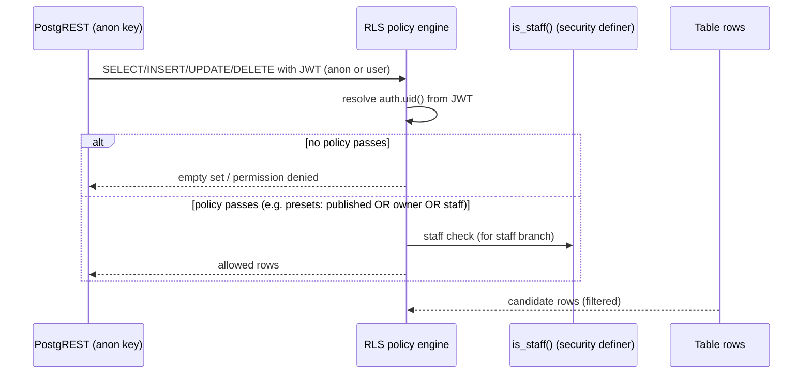

**Key policies (from `supabase/migrations/20260728000000_database_foundation.sql`):**

| Table | Policy | Effect |
|---|---|---|
| `users` | `users_select_public using (true)` | anyone can read **full rows incl. `email`** ⚠️ TODO SEC-1 |
| `presets` | published visible; own visible; staff visible | draft/pending/rejected hidden from public |
| `preset_likes` | `preset_likes_select_public using (true)` | anyone can enumerate likes ⚠️ TODO SEC-2 |
| `follows` | `follows_select_public using (true)` | social graph enumerable ⚠️ TODO SEC-2 |
| `comments` | select public; insert own; no update/delete for users | moderation not exposed (TODO MISS-6) |
| `notifications` | `notifications_staff_insert` | **only staff can insert** — yet nothing inserts (TODO MISS-2) |
| Storage buckets | first path segment must equal `auth.uid()`; staff override | users can only touch their own folder |

**Rule of thumb for DAL code:** RLS is the final gate — a DAL query may return fewer rows than requested; the app must not assume PostgREST bypasses it (the service client would, but it's unused).

---

## 8. DAL Flow

**Layering (strict):** Server Component / Route Handler → `data/*.ts` (thin re-export wrappers) → `dal/*.ts` → Supabase client. UI code never touches `supabase` directly; route handlers only via `lib/api/auth.ts` contexts.

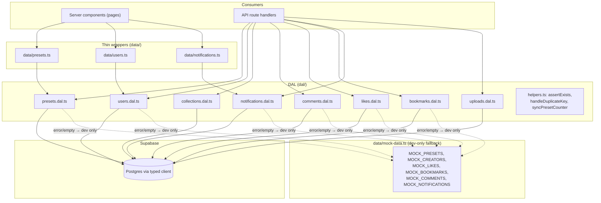

**⚠️ Mock fallback (was a critical gotcha — FIXED 2026-08-03, TODO BUG-1):** now env-gated via `dal/mock-fallback.ts` (`isMockFallbackEnabled` = non-production). Query error → dev: log + mock · prod: rethrow. Empty → dev: mock · prod: real empty (`null`/`[]`/`0`). `getPresetBySlug`/`getUserByUsernameOrNull`/`getUserById` return `null` for unknown keys (pages 404); `getUserByUsername` throws `ApiError(not_found)` in prod.

**Shared helpers (`dal/helpers.ts`):**
- `assertExists(data, msg)` → throws `ApiError(not_found)`.
- `handleDuplicateKey(err, msg)` → rethrows as `ApiError(conflict)` when Postgres code `23505`.
- `syncPresetCounter(client, presetId, table, column)` → full `COUNT(*)` + `UPDATE presets` (O(n), intentionally simple). Used after like/bookmark/comment mutations. Comments count excludes `is_removed`.

**Naming contract:** DAL returns **snake_case** (DB shape); UI shape (camelCase) produced by `lib/mappers.ts` `mapPresetToCardPreset` at the page boundary.

---

## 9. Server Component ↔ Client Component Interaction

**Pattern (per page):** Server Component (async, awaits `searchParams`) → builds data → passes **plain serializable props** to a thin client wrapper → wrapper renders the two view compositions. Client wrappers own all interactivity; they re-fetch via `fetch("/api/...")` and mutate local state optimistically.

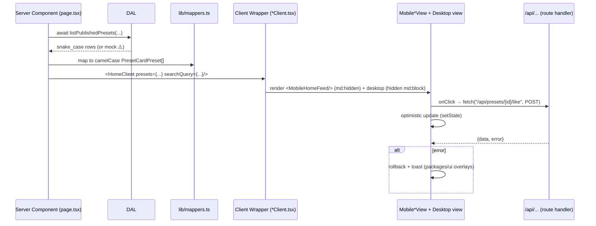

**Rules:**
- Props crossing the boundary must be serializable (no functions, no Date instances — timestamps as ISO strings).
- Server components never import client components' state; the client wrapper is the *only* bridge.
- `useAuth().requireAuth()` lives in client land; `getCurrentProfile()` in server land — same truth, two mechanisms.

---

## 10. Mobile / Desktop Rendering

**Breakpoint:** `md` (768px) is the app's mobile boundary — set in `packages/ui/src/tokens/tokens.css` and enforced in `apps/web/src/styles/globals.css` (52px touch targets below `md`).

**Two compositions per page — not responsive variants.** Each page that has mobile-specific UX ships:
- `<Mobile*View>` rendered inside `md:hidden` (hand-written mobile layout, often bottom-sheet/native-feel), and
- the desktop/tablet layout inside `hidden md:block`.

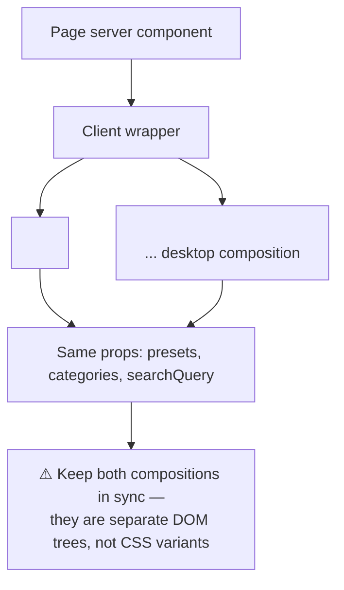

Files following this pattern today: `home/`, `bookmarks/`, `dashboard/`, `explore/`, `likes/`, `preset/[slug]/`, `u/[username]/` (each with a `Mobile*View.tsx` + desktop composition). Shared chrome in `packages/ui`: `mobile-bottom-nav` (mobile) vs `navigation-sidebar` + `top-bar` (desktop), composed by `apps/web/src/app/_components/layout-shell.tsx`.

---

## 11. API Lifecycle

Uniform envelope: `{ data, error, meta: { requestId, ... } }` (types in `packages/types/src/api.ts`). Every handler is a `try/catch` around the same pipeline:

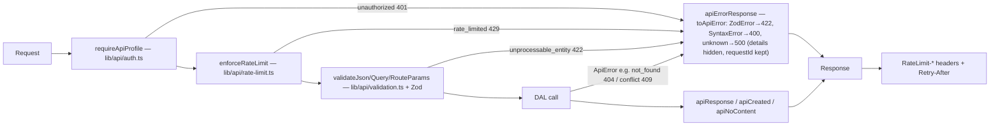

**Details:**
- **Status codes** (`lib/api/errors.ts`): 400 bad_request · 401 unauthorized · 403 forbidden · 404 not_found · 409 conflict · 413 payload_too_large · 415 unsupported_media_type · 422 unprocessable_entity · 429 rate_limited · 500 internal_server_error.
- **Authorization guards** (`lib/api/authorization.ts`): `assertAuthorized`, `assertSameUser`, `assertStaff`, `assertOwnerOrStaff`.
- **Rate limiting** (`lib/api/rate-limit.ts`): key = `{scope}:user:{userId}` or `{scope}:ip:{ip}`; `MemoryRateLimitStore` (⚠️ per-instance only, TODO TD-7); returns `RateLimit-*` headers.
- **Logging** (`lib/api/logger.ts`): `apiLogger.{debug,info,warn,error}` with `requestId`, method, path, userId; debug suppressed in production.
- **Pagination** (`lib/api/pagination.ts`): page-based (`page`/`limit`, default 24, max 100) — used everywhere; cursor helpers exist but unused (TODO TD-5).
- **Next 15:** dynamic route params are `Promise` → `validateRouteParams(await params, schema)`.

---

## 12. Caching

Current state — deliberately minimal, mostly per-request:

| Layer | Mechanism | Scope | Notes |
|---|---|---|---|
| Supabase server client | React `cache()` in `lib/supabase/server.ts` | per request tree | dedupes client creation within one render |
| `getCurrentUser` / `getCurrentProfile` | React `cache()` in `lib/supabase/auth.ts` | per request tree | dedupes auth lookup + profile select |
| Rate limit store | in-memory `Map` | per server instance | ⚠️ resets on cold start (TODO TD-7) |
| Pages | none (all dynamic) | — | no `revalidate`/ISR (TODO PERF-4) |
| Images | 6× `next/image`, 34× plain `` | — | TODO PERF-2 |
| Mock data | dev-only (BUG-1 fixed); module-load `Math.random()`/`Date.now()` | per process | dev-only; PERF-3 tracks removal |

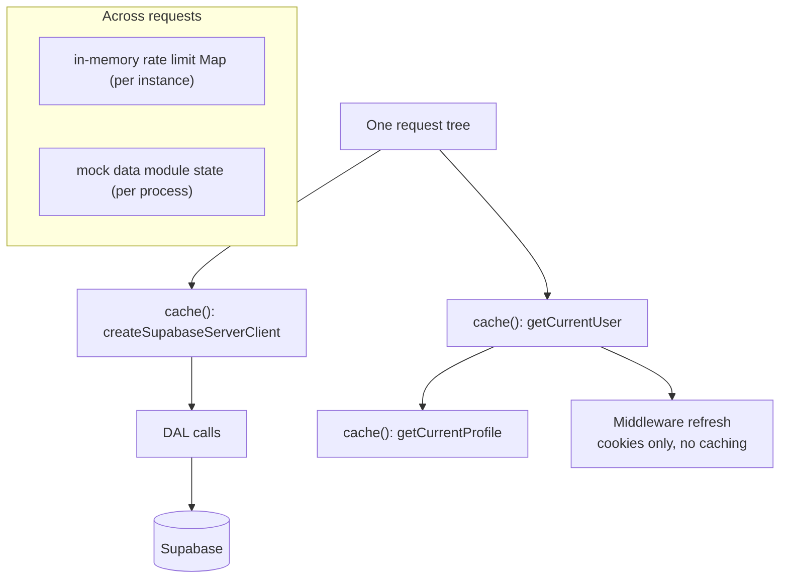

**Consequence:** every page render = 2–3 round-trips (auth + profile + unread count) even for anonymous visitors (TODO PERF-1). No Redis/Upstash/ISR anywhere.

---

## 13. Middleware

`apps/web/middleware.ts` — Next.js edge middleware (file lives at `apps/web/`, not under `src/`).

**Matcher:** everything except static assets (`_next/static`, `_next/image`, `favicon.ico`, image extensions).

**Logic:**
1. `validatePublicEnv()`; if Supabase env missing → protect nothing (redirect protected routes to login defensively, else pass).
2. **Optimization:** if pathname is NOT in `protectedRoutes` → return early (no auth API call on public pages).
3. For protected routes, build `@supabase/ssr` server client over `request.cookies`, call `auth.getUser()`; refresh session cookies on response.
4. No user → redirect `/auth/login?redirectTo={pathname}{search}` (safe: `redirectTo` validated on the client and in callback route).
5. Errors (Supabase unreachable) are swallowed → request continues (page-level guards still apply).

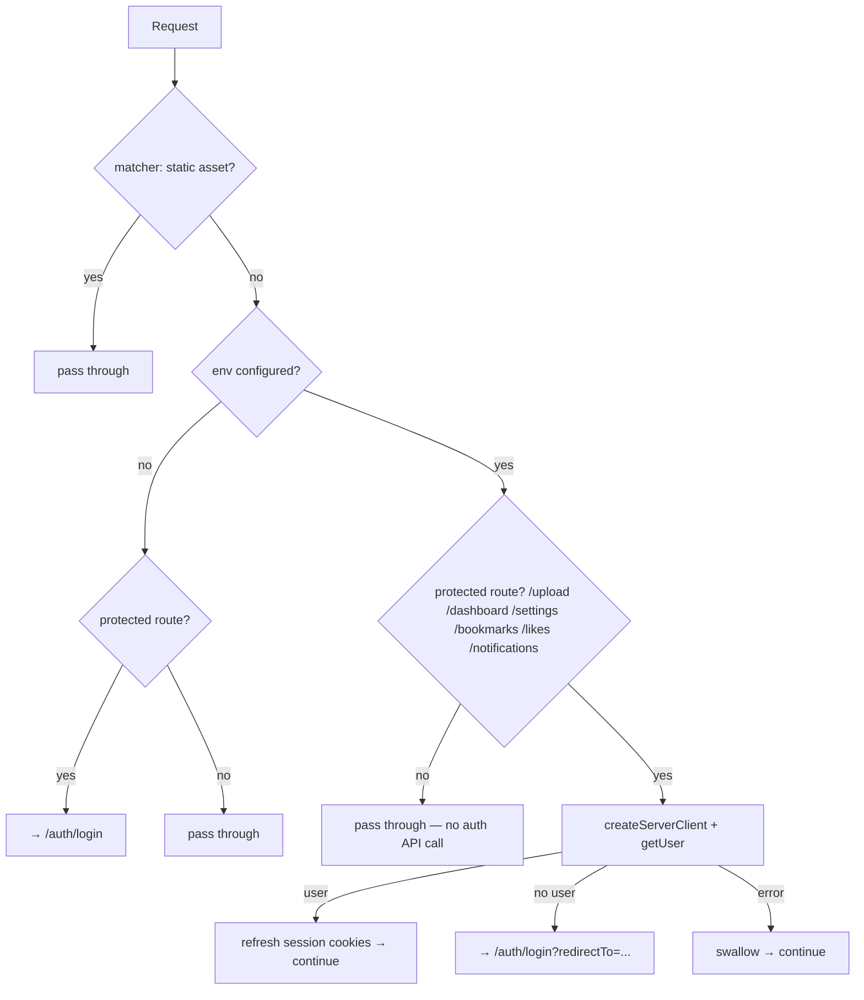

---

## 14. State Management

**No global state library.** react-query/zustand are installed but unused (TODO TD-2). The actual strategy:

| Concern | Mechanism |
|---|---|
| Server-truth (current user, profiles, lists) | Server components + DAL per request |
| Client auth gate | `AuthContext` (`context/AuthContext.tsx`): `currentUser` prop + `requireAuth()` + `AuthModal` open state |
| Page-local UI state | `useState` in client wrappers / `Mobile*View` |
| Server mutations (like/bookmark/follow/comment) | `fetch("/api/...")` + **optimistic update** (setState immediately, rollback on error) |
| URL state (search, category, pagination) | `searchParams` (server) / `useSearchParams` (client) — no state library |
| Form state (upload wizard, login) | local `useState` (no react-hook-form) |
| Toasts/modals | `packages/ui` overlays (toast, modal) — component-level state |

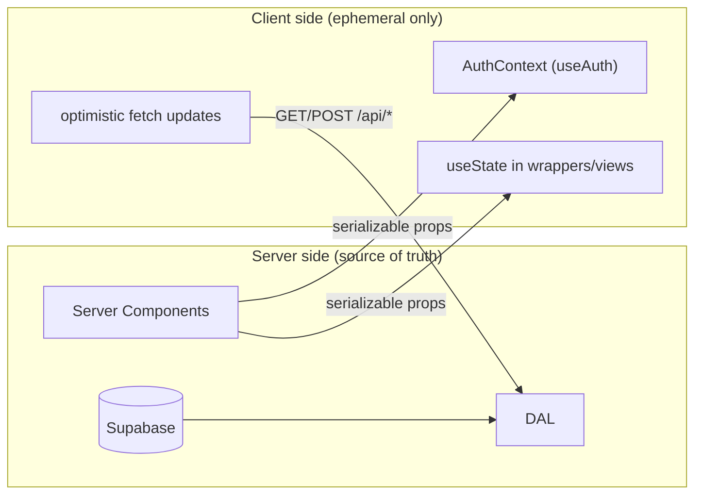

**Rule:** never duplicate server truth in a client store; if a client value must survive navigation, keep it in the URL (`searchParams`), not in memory.

---

## 15. Folder Ownership

| Path | Owns | Must not |
|---|---|---|
| `apps/web/src/app/**` | routes, pages, page-scoped components (`_components/`) | DB queries (use DAL), business rules |
| `apps/web/src/app/api/**` | HTTP contract: auth gate, rate limit, validation, response envelope | SQL, UI |
| `apps/web/src/middleware.ts` | session refresh + route protection | business logic |
| `apps/web/src/dal/**` | all Supabase queries/mutations, counters, error→`ApiError` mapping | HTTP concerns |
| `apps/web/src/data/**` | mock dataset + thin DAL re-exports for pages | raw queries |
| `apps/web/src/lib/api/**` | API plumbing: auth context, errors, rate-limit, validation, responses, uploads, pagination, logger | routes, DAL |
| `apps/web/src/lib/supabase/**` | client factories, auth helpers (server-side), storage URLs | domain logic |
| `apps/web/src/lib/mappers.ts` | snake_case→camelCase shape mapping | queries |
| `apps/web/src/context/**` | client-side auth context (AuthProvider/useAuth) | data fetching |
| `packages/ui/src/**` | presentational components + tokens (atomic design) | Supabase, Next-specific APIs |
| `packages/types/src/**` | shared types (Database, API, components) | runtime logic |
| `packages/config/src/**` | env validation + site config | app logic |
| `supabase/migrations/**` | schema, RLS, triggers, storage buckets | app code |
| `supabase/seed.sql` | taxonomy only (categories/tags) — **no fake users/presets** | fake content |

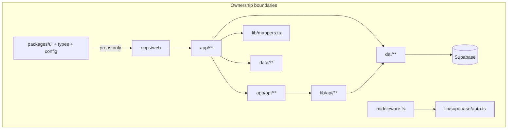

**Enforcement:** no `@/dal` imports in `packages/*`; no `supabase` client imports in components; no raw `fetch` to Supabase REST in app code (everything through DAL or `/api`).

---

## 16. Diagram Index

| Flow | Diagram | Section |
|---|---|---|
| Dependency graph | `graph TD` (workspaces + external) | §1 |
| SSR page request | `sequenceDiagram` | §2a |
| Client API request | `sequenceDiagram` | §2b |
| Auth (login + OAuth + callback + bootstrap) | `sequenceDiagram` | §3 |
| Upload (presigned URL) | `sequenceDiagram` | §4 |
| Preset publishing | `flowchart TD` (wizard steps) | §5 |
| Supabase clients | `graph LR` | §6 |
| RLS enforcement | `sequenceDiagram` | §7 |
| DAL + mock fallback | `flowchart TD` | §8 |
| Server ↔ Client props | `sequenceDiagram` | §9 |
| Mobile/Desktop split | `flowchart TD` | §10 |
| API lifecycle | `flowchart LR` | §11 |
| Caching layers | `flowchart TD` | §12 |
| Middleware decision tree | `flowchart TD` | §13 |
| State management | `flowchart LR` | §14 |
| Folder ownership | `graph TD` | §15 |

---

*Maintained by the assistant (Nawala). Update in the same commit as any change to the flows above (see §0 Sync Contract).*
